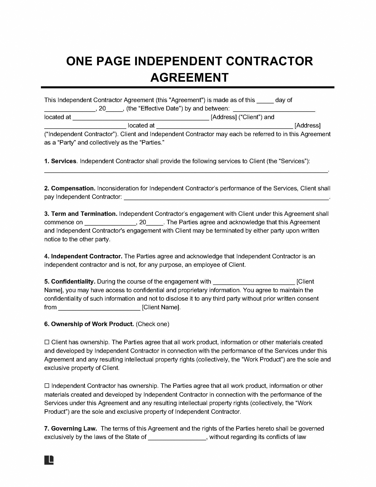
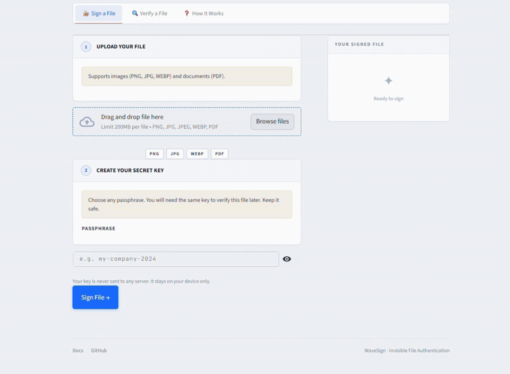

# WaveSign 

**Invisible file signing and tamper detection for images and documents.**

Sign any image or PDF with an invisible signature. Share it. Verify it later — any modification, no matter how small, is detected instantly.

---

## Try It

🔗 [wavesign.streamlit.app](https://phasesig-rbek68ksvn9aty6wize8wo.streamlit.app/)

---

## What It Does

- **Sign** — Upload an image or PDF, set a secret key, download a signed package
- **Verify** — Upload the signed file + verification file + key → instant ✅ or ❌
- **Invisible** — Signed files look identical to the originals
- **Sensitive** — Any edit after signing invalidates the signature

Supports PNG, JPG, WEBP, and multi-page PDF.

---

## Use Cases

- Contracts and documents — detect any edit after signing
- AI-generated images — prove a file is unmodified since export
- Creative work — sign before publishing, verify origin later
- Sensitive files — any modification immediately invalidates the signature

---

# Demo
WaveSign uses advanced **plane wave diffraction phase-shift technology** to embed cryptographic signatures into images and documents. The signature is mathematically integrated into the file's phase structure, making it completely invisible to the naked eye while ensuring robust authenticity.

## 📸 Invisible Signature

The primary advantage of WaveSign is its non-destructive nature. The signature does not degrade image quality or affect the readability of document text.

| Original Image (Before) | Signed Image (After) |
| :---: | :---: |
|  |  |

| Original Document (Before) | Signed Document (After) |
| :---: | :---: |
|  |  |

**Key Benefits:**
* **Invisible Protection:** No visible watermarks or artifacts.
* **Zero Quality Loss:** Ideal for high-resolution images and professional photography.
* **Text Integrity:** Document readability remains 100% intact for PDFs and scans.

## 🎥 User Guide

The following clips demonstrate the seamless workflow for protecting and verifying your files.

### 1. Signing Flow
Upload your file, enter your secret key, and the system generates a signed version instantly.

### 2. Verification Flow
Confirm the integrity and origin of any signed file by uploading it with the corresponding secret key.

---

## License

MIT
